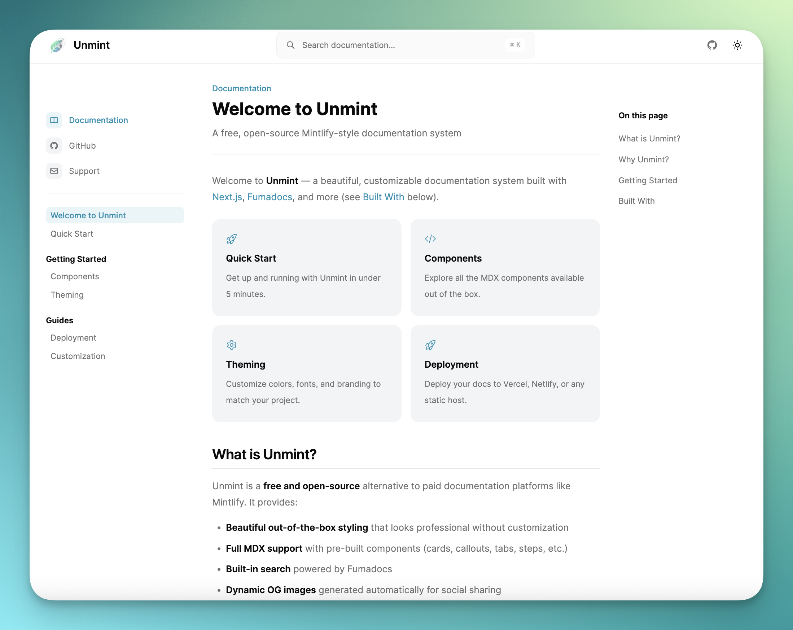

<div align="center">


# unmint

### Beautiful docs. Zero cost. Full control.

A free, open-source Mintlify-style documentation system built with Next.js and Fumadocs.

[](https://www.npmjs.com/package/create-unmint)
[](https://www.npmjs.com/package/create-unmint)
[](LICENSE)

<br />



<br />

<table>
<tr>
<td>
<a href="https://unmint.dev/docs">
  
</a>
</td>
<td>

```bash
npx create-unmint@latest my-docs
```

</td>
</tr>
</table>

</div>

<br />

## Features

- **Beautiful out-of-the-box** — Professional styling without configuration
- **MDX Components** — Cards, callouts, tabs, steps, accordions, and more
- **Built-in Search** — Full-text search powered by Fumadocs
- **Dynamic OG Images** — Auto-generated social preview images
- **Dark Mode** — Seamless light/dark theme switching
- **Easy Theming** — Single config file for all customization
- **SEO Optimized** — Automatic meta tags and sitemap

> **Note:** Unmint is self-hosted, not a SaaS. You own everything and deploy it yourself.

## Quick Start

```bash
npx create-unmint@latest my-docs
```

This will prompt you for project configuration and set up everything automatically.

#### CLI Options

```bash
# Create with all defaults (no prompts)
npx create-unmint@latest my-docs --yes

# Update an existing project to latest
cd my-docs
npx create-unmint@latest --update
```

### Add to Existing Next.js Project

Already have a Next.js site? Add Unmint docs alongside your existing app:

```bash
# Navigate to your existing project
cd my-existing-site

# Add docs at /docs route
npx create-unmint@latest --add

# Or specify a custom route
npx create-unmint@latest --add --path /documentation
```

This will:
- Detect your project structure (src/app or app)
- Copy docs components and sample content
- Merge dependencies into your package.json
- Add scoped CSS variables (won't conflict with your existing styles)
- Wrap your next.config with MDX support

Your existing site remains untouched - docs are added as a new route.

#### Manual Installation

You can also clone the template directly:

```bash
# Clone just the template
git clone https://github.com/gregce/unmint.git
cp -r unmint/packages/template my-docs
cd my-docs

# Install dependencies
npm install

# Start development server
npm run dev
```

Open [http://localhost:3000](http://localhost:3000) to see your docs.

## Repository Structure

This is a monorepo containing:

```
unmint/
├── packages/
│   ├── create-unmint/   # CLI tool (npx create-unmint)
│   └── template/        # The documentation template
├── package.json
└── README.md
```

## Project Structure

```
my-docs/
├── app/
│   ├── docs/                 # Documentation routes
│   │   ├── layout.tsx        # Docs layout (header, sidebar, footer)
│   │   └── [[...slug]]/      # Dynamic page rendering
│   ├── api/
│   │   ├── search/           # Search API endpoint
│   │   └── og/               # OG image generation
│   └── components/
│       └── docs/             # Docs-specific components
│           └── mdx/          # MDX components (Card, Callout, etc.)
├── content/
│   └── docs/                 # Your MDX documentation files
│       ├── index.mdx         # Homepage
│       ├── meta.json         # Navigation structure
│       └── *.mdx             # Your pages
├── lib/
│   ├── theme-config.ts       # ⭐ Customize your theme here
│   ├── docs-source.ts        # Fumadocs source config
│   └── utils.ts              # Utility functions
├── public/                   # Static assets (logo, images)
├── source.config.ts          # MDX/Fumadocs configuration
└── package.json
```

## Customization

### 1. Update Site Info

Edit `lib/theme-config.ts`:

```typescript
export const siteConfig = {
  name: 'My Docs',
  description: 'Documentation for My Project',
  url: 'https://docs.example.com',
  logo: {
    src: '/logo.png',
    alt: 'My Project',
    width: 32,
    height: 32,
  },
  links: {
    github: 'https://github.com/your-org/your-repo',
    discord: 'https://discord.gg/your-invite',
    support: 'mailto:support@example.com',
  },
}
```

### 2. Customize Colors

```typescript
export const themeConfig = {
  colors: {
    light: {
      accent: '#0891b2',  // Your brand color
    },
    dark: {
      accent: '#22d3ee',  // Brighter for dark mode
    },
  },
}
```

### 3. Add Your Logo

Place your logo in `public/logo.png` and update `siteConfig.logo.src`.

### 4. Write Documentation

Create MDX files in `content/docs/`:

```mdx
---
title: My Page
description: A description of my page
---

# Hello World

This is my documentation page!

<Tip>
You can use all the built-in components.
</Tip>
```

### 5. Configure Navigation

Edit `content/docs/meta.json`:

```json
{
  "title": "Documentation",
  "pages": [
    "index",
    "quickstart",
    "---Getting Started---",
    "installation",
    "configuration",
    "---Guides---",
    "deployment"
  ]
}
```

## Available Components

### Cards

```mdx
<CardGroup cols={2}>
  <Card title="Quick Start" icon="rocket" href="/docs/quickstart">
    Get started in 5 minutes
  </Card>
  <Card title="API Reference" icon="code" href="/docs/api">
    Explore our API
  </Card>
</CardGroup>
```

### Callouts

```mdx
<Info>Informational message</Info>
<Tip>Helpful tip</Tip>
<Warning>Warning message</Warning>
<Note>Additional note</Note>
<Check>Success message</Check>
```

### Steps

```mdx
<Steps>
  <Step title="Install">
    Run `npm install`
  </Step>
  <Step title="Configure">
    Edit your config file
  </Step>
</Steps>
```

### Tabs

```mdx
<Tabs>
  <Tab title="npm">npm install package</Tab>
  <Tab title="yarn">yarn add package</Tab>
</Tabs>
```

### Accordions

```mdx
<AccordionGroup>
  <Accordion title="Question 1">Answer 1</Accordion>
  <Accordion title="Question 2">Answer 2</Accordion>
</AccordionGroup>
```

## Deployment

### Vercel (Recommended)

1. Push to GitHub
2. Import at [vercel.com/new](https://vercel.com/new)
3. Deploy!

### Netlify

1. Add `netlify.toml`:
   ```toml
   [build]
     command = "npm run build"
     publish = ".next"
   [[plugins]]
     package = "@netlify/plugin-nextjs"
   ```
2. Connect and deploy

### Other Hosts

Any platform supporting Next.js works. Run `npm run build` and deploy the output.

## Contributing

Contributions are welcome! Please feel free to submit a Pull Request.

## License

MIT License - feel free to use this for any project.

## Credits

Built with:
- [Next.js](https://nextjs.org)
- [Fumadocs](https://fumadocs.vercel.app)
- [Tailwind CSS](https://tailwindcss.com)

Inspired by [Mintlify](https://mintlify.com).
